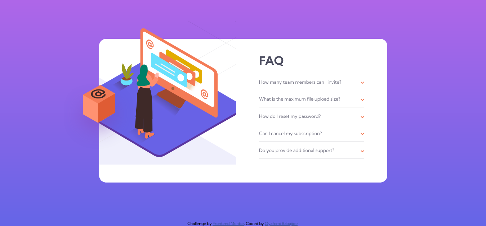
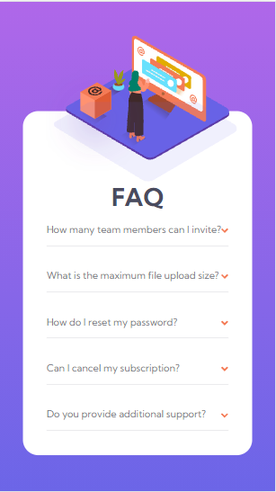

# Frontend Mentor - FAQ accordion card solution

This is a solution to the [FAQ accordion card challenge on Frontend Mentor](https://www.frontendmentor.io/challenges/faq-accordion-card-XlyjD0Oam). Frontend Mentor challenges help you improve your coding skills by building realistic projects.

## Table of contents

- [Overview](#overview)
  - [The challenge](#the-challenge)
  - [Screenshot](#screenshot)
  - [Links](#links)
  - [Built with](#built-with)
  - [What I learned](#what-i-learned)
  - [Useful resources](#useful-resources)
- [Author](#author)

## Overview

### The challenge

Users should be able to:

- View the optimal layout for the component depending on their device's screen size
- See hover states for all interactive elements on the page
- Hide/Show the answer to a question when the question is clicked

### Screenshot

### Links

- Solution URL: [Add solution URL here](https://github.com/Babajide777/faq-accordion-card)
- Live Site URL: [Add live site URL here](https://babajide-faq-accordion-card.netlify.app/)

### Built with

- Semantic HTML5 markup
- CSS custom properties
- Flexbox
- Mobile-first workflow
- SASS

### What I learned

I learned how to use SASS in this project.

### Useful resources

- [codeSTACKr](https://www.youtube.com/watch?v=_a5j7KoflTs&t=45s) - This helped me learn the necessary bits of SASS

## Author

- Website - [Oyafemi Babajide](https://babajide-portfolio.netlify.app/)
- Frontend Mentor - [Babajide777](https://www.frontendmentor.io/profile/Babajide777)
- Twitter - [@jid_Boss](https://www.twitter.com/jid_Boss)
